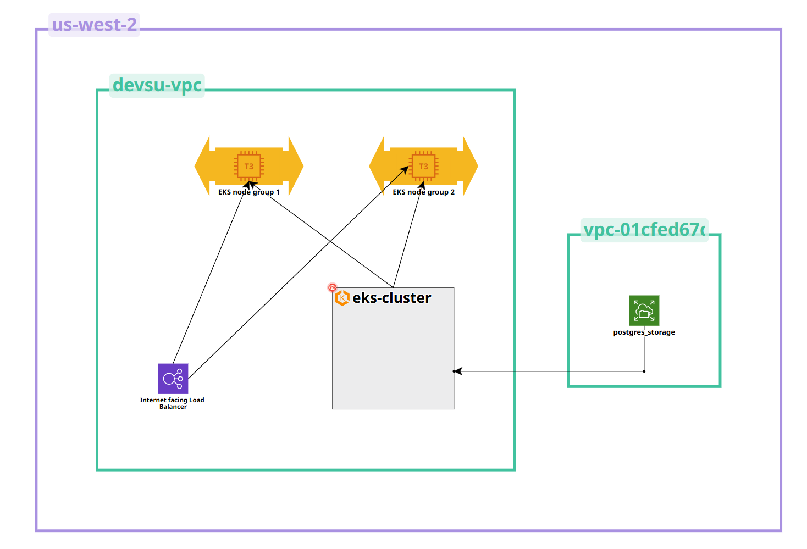

# Demo Devops Python

This is a simple application to be used in the technical test of DevOps.

## Documentation

### Changes made
- Parametrized the database to be able to use postgres for production and sqlite for development
- Use gunicorn to serve the app

### Deployment URL
- Note: As of 12/02/2025 23:00 UTC the endpoint has been closed to avoid excess costs from AWS services, if you need to see the application again you can write me an email and i can set it up again.
- 
- http://ab8e05c97b7e24a37b6556951de5b303-66e7abf14e1f5ab5.elb.us-west-2.amazonaws.com/api/users

### AWS diagram


### Kubernetes diagram

## Getting Started

### Prerequisites

- Python 3.11.3

### Installation

Clone this repo.

```bash
git clone https://bitbucket.org/devsu/demo-devops-python.git
```

Install dependencies.

```bash
pip install -r requirements.txt
```

Migrate database

```bash
py manage.py makemigrations
py manage.py migrate
```

### Database

The database is generated as a file in the main path when the project is first run, and its name is `db.sqlite3`.

Consider giving access permissions to the file for proper functioning.

Note: The database for production is postgres.

## Usage

To run tests you can use this command.

```bash
py manage.py test
```

To run locally the project you can use this command.

```bash
py manage.py runserver
```

Open http://localhost:8000/api/ with your browser to see the result.

### Features

These services can perform,

#### Create User

To create a user, the endpoint **/api/users/** must be consumed with the following parameters:

```bash
  Method: POST
```

```json
{
    "dni": "dni",
    "name": "name"
}
```

If the response is successful, the service will return an HTTP Status 200 and a message with the following structure:

```json
{
    "id": 1,
    "dni": "dni",
    "name": "name"
}
```

If the response is unsuccessful, we will receive status 400 and the following message:

```json
{
    "detail": "error"
}
```

#### Get Users

To get all users, the endpoint **/api/users** must be consumed with the following parameters:

```bash
  Method: GET
```

If the response is successful, the service will return an HTTP Status 200 and a message with the following structure:

```json
[
    {
        "id": 1,
        "dni": "dni",
        "name": "name"
    }
]
```

#### Get User

To get an user, the endpoint **/api/users/<id>** must be consumed with the following parameters:

```bash
  Method: GET
```

If the response is successful, the service will return an HTTP Status 200 and a message with the following structure:

```json
{
    "id": 1,
    "dni": "dni",
    "name": "name"
}
```

If the user id does not exist, we will receive status 404 and the following message:

```json
{
    "detail": "Not found."
}
```

## License

Copyright © 2023 Devsu. All rights reserved.
